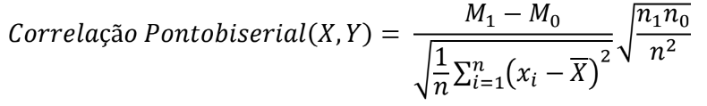

# Coeficiente de correlação ponto-bisserial
Código implementado compondo os resultados da pesquisa (PIBIC) "Geração de Pseudo-julgamentos de Relevância - Teste de Correlação Ponto-bisserial" (set 2022 - ago 2023) realizada no IFPE Campus Igarassu, mediante minha graduação superior no curso de Tecnologia em Sistemas para Internet.
##
## Equação implementada

  </img>

